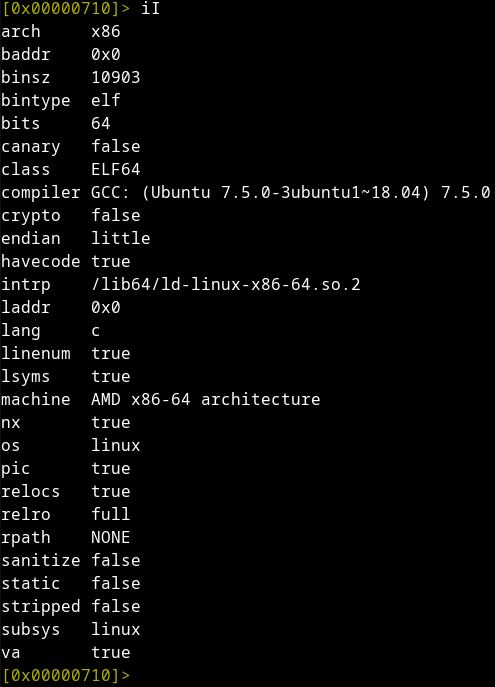
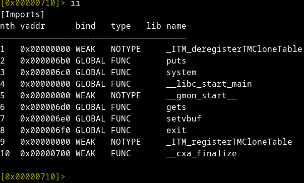
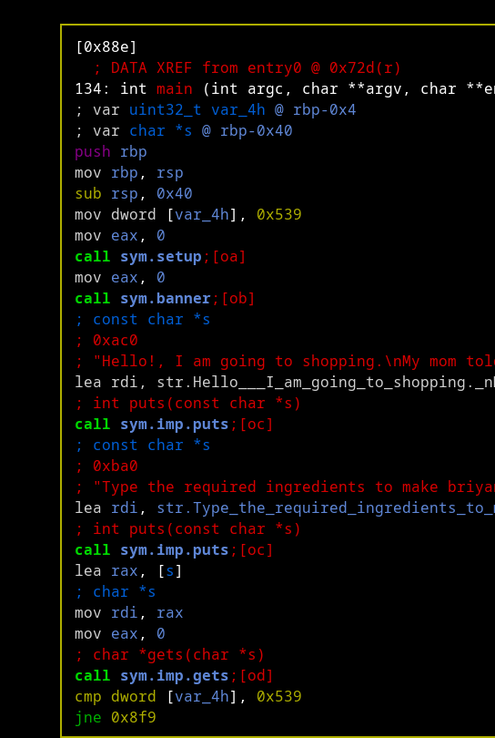
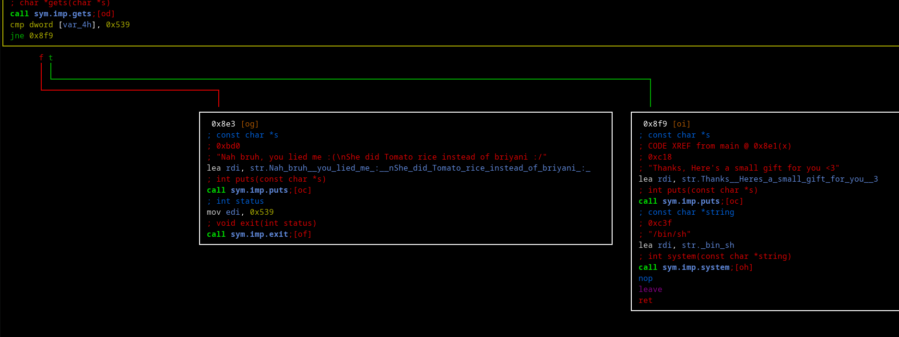

# try hack me pwn101 room
### 101

###### *basic recon*


##### *what bin is using*


as you can see there's call to get's
so bufferoverflow is possible


##### *disassemble*



```
let's see how the stack is used well there's allocation of 0x40 by that sub rsp, 0x40
and 0x539 is moved into memory at address rbp-0x4
and there's lea rax, [s] btw s is rbp-0x40 this value will be used by gets
and rbp-0x40 is lower on the stack so gets will go up filling the data
that is beign read so it can reach rbp-0x4 and change what is stored there
and value stored at rbp-0x4 is beign compared agains the value of 0x539
cmp dwod [var_4h], 0x539
we can see that there's jump if not equal after in case of true we will jump to the right block
that has that 
call sym.imp.system
so all we need to do is to change the value at rbp-0x4 to anything else other than 0x539
so we will just fill what was intneded to be filled by gets and add 1 to change a byte ar rbp-0x4
```
