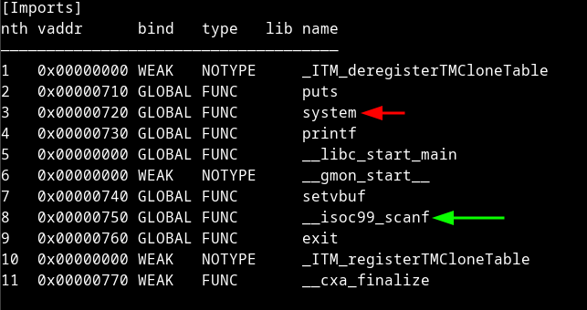
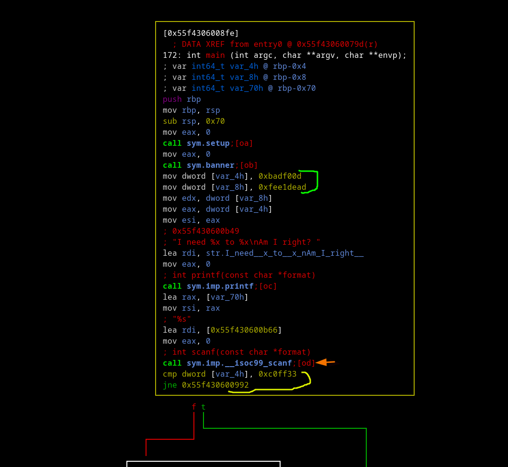

### 102

#### basic recon


```
we see that there's no cannary which is good for me
a littel endian is true, and nx is true that means
i can not put some code in the stack and execute 
so i guess this will some form of overflow
```

let's see what this is file is importing



```
we can see there's system so mybe there's some shell
that we can jump to
program is using scanf aka no boundry check
```

let's see flow of the program



