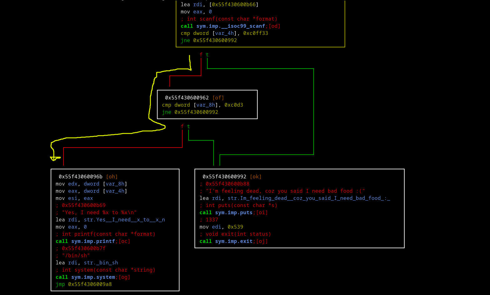

### 102

#### basic recon


```
we see that there's no cannary which is good for me
a littel endian is true, and nx is true that means
i can not put some code in the stack and execute 
so i guess this will some form of overflow
```

let's see what this is file is importing


```
we can see there's system so mybe there's some shell
that we can jump to
program is using scanf aka no boundry check
```

let's see flow of the program




```
as you can left bottom block has *call sym.imp.system*
we need somehow to end up here

**let's see how**
well at start value 0xbadfood is stored at var_4h
and we see at the buttom

*cmp dword [var_4h], 0xc0ff33*
*jne 0x55f430600992*

we need this jne to fail thus will go to left aka right direction
and to make jne fail we need to put the value 0xc0ff33 at location var_4h
and var_4h is rbp-0x4

if we pass this point we will end up in other comparison

*cmp dword [var_8h] 0xc0de*
*jne 0x55f430600992*

we need to do the same again put the value at 0xc0de

we can see that scanf is working var_70h which is rbp-0x70
we need to fill (0x70-0x8) with some values 
and after that we should put value 0xc0de and after that put
the value 0xcoff33

btw as we saw before that out binary is littel endian keep that
in mind
```
