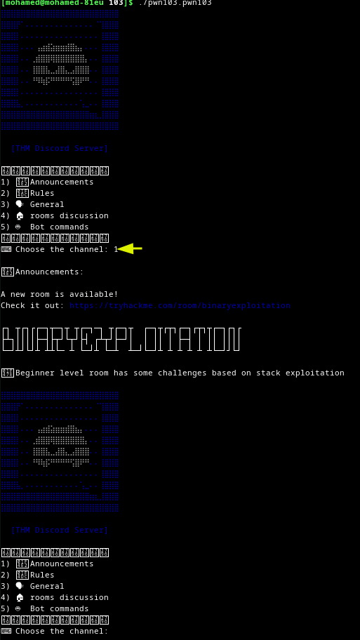
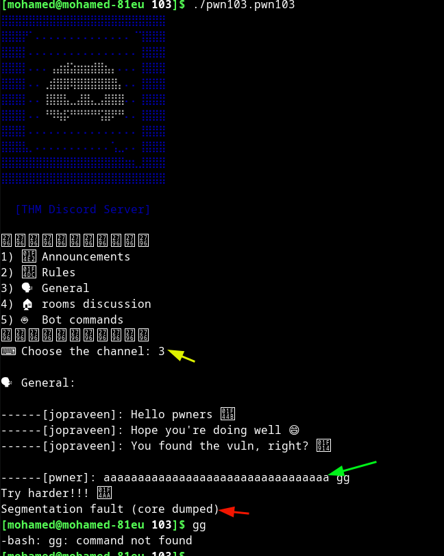

### 103

#### basic usage






````
it seems that when i enter 3 i got to place where the program
is interacting with me at first Segmentation fault which is good
signal probably no canary if it was i would got stack smashing
detected probabaly
````

#### basic recon


#### *what the binary is using*


````
we see that __isoc99_scanf means that i will try to override something
and we see also system so probably a shell will be given to us
and i think that we will have to interact with strncmp somehow
````

#### *how can we get to system*


````
we see that system is beign called by sym.admins_only let's find out how
can we get to this function to
when i looked for who is calling admins_only i could not find any refrence
so we need to override the instruction register to jump to it
````

#### *flow*

````
when we interact with program i will target general case and there's function called general
so i'll start there
````


````
as you can see that there's scanf that's good
you may see that strcmp but it does not matter
because i want to end up in the try harder we 
should only avoid "yes" as input becuase strcmp
using it and why all of this because i intend to
put address of admins_only using the above scanf
and i should reach ret instruction that's why i want
to go to try harder block
````

#### *Exploit*


````
scanf is called with '%s' and with rbp-0x20
we need to fill this 0x20 with random stuff
and btw at the top of the stack there's rbp
since binary is 64 bit that means that rbp is 64 bit
so we need to add 8 bytes and then we will put the 
address of admins_only function
````
