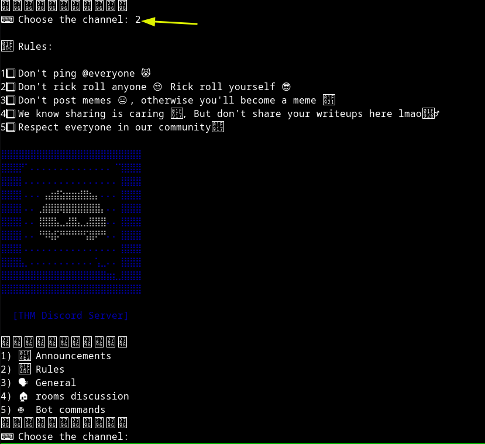

### 103

#### basic usage





````
it seems that when i enter 3 i got to place where the program
is interacting with me at first Segmentation fault which is good
signal probably no canary if it was i would got stack smashing
detected probabaly
````

#### basic recon


#### *what the binary is using*


